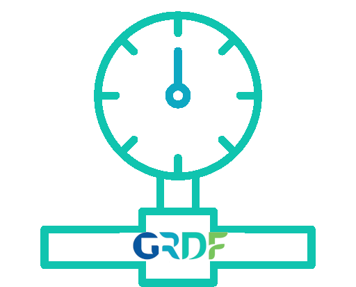

<p align="center"></p>

<br/>


<h2 align="center">CRDF Consommation</h2>
<br/>

<br/>

## Requirements

- Install requirements (`pip install -r requirements.txt`)

## Usage

Here is an example script:

```python
import GrdfConsommation


profil = GrdfConsommation.GRDFConsommation(
                                            email="<your email>", 
                                            password="<your password>", 
                                            nbDays=10, # Number of days to recover from this day
                                            pce_id="<your pce id>" # For more speed you can enter your pce identifier (but it is not mandatory)
                                        )


data = profil.data()

print(data)

```

Result example:
```json
[
    {"day": "2022-07-06", "consommation": 9},
    {"day": "2022-07-07", "consommation": 10}, 
    {"day": "2022-07-08", "consommation": 12},
    {"day": "2022-07-09", "consommation": 10},
    {"day": "2022-07-10", "consommation": 11},
    {"day": "2022-07-11","consommation": 10},
    {"day": "2022-07-12", "consommation": 11},
    {"day": "2022-07-13", "consommation": 11}
]
```

And if you want to compare with last year:

```python
import GrdfConsommation
import datetime


profil = GrdfConsommation.GRDFConsommation(
                                            email="<your email>", 
                                            password="<your password>", 
                                            nbDays=10, # Number of days to recover from this day
                                            pce_id="<your pce id>" # For more speed you can enter your pce identifier (but it is not mandatory)
                                        )

#données des n derniers jours
data = profil.data()

#-------------------------------------------------------#

#Change la date en celle de l'annier derniere
profil.endDate = datetime.date.today().replace(year=datetime.date.today().year - 1)
profil.startDate = profil.endDate + datetime.timedelta(days=-profil.nbDays)

#-------------------------------------------------------#

#données des n derniers jours d'il y a un an
data2 = profil.data()


#Consommation de cette année
for consom in data:
    print(consom["day"] + ":", consom["consommation"] , "kWh")

print("#---------------------------#")

#Consommation de l'année derniere
for consom in data2:
    print(consom["day"] + ":", consom["consommation"] , "kWh")
```

Result example:
```text
2022-07-06: 9 kWh
2022-07-07: 10 kWh
2022-07-08: 12 kWh
2022-07-09: 10 kWh
2022-07-10: 11 kWh
2022-07-11: 10 kWh
2022-07-12: 11 kWh
2022-07-13: 11 kWh
#---------------------------#
2021-07-06: 11 kWh
2021-07-07: 11 kWh
2021-07-08: 11 kWh
2021-07-09: 11 kWh
2021-07-10: 12 kWh
2021-07-11: 10 kWh
2021-07-12: 12 kWh
2021-07-13: 13 kWh
2021-07-14: 11 kWh
2021-07-15: 12 kWh
2021-07-16: 10 kWh
```